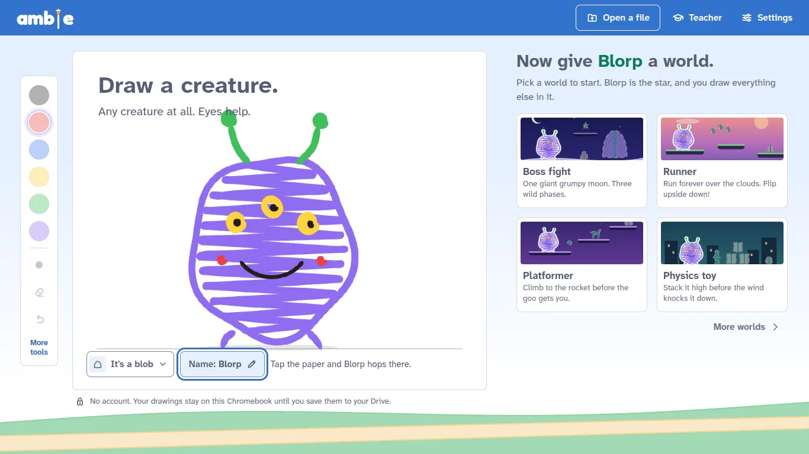
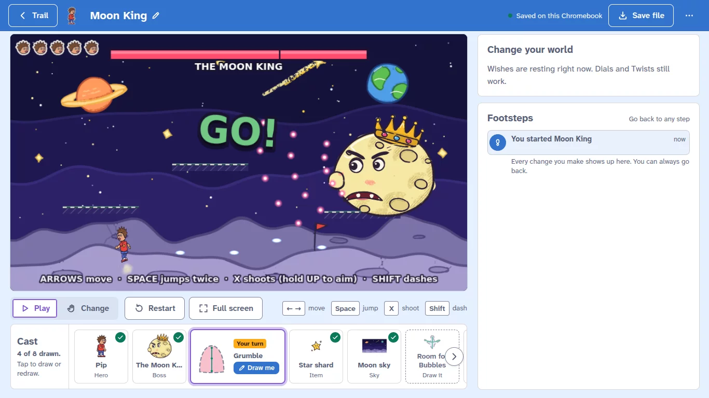
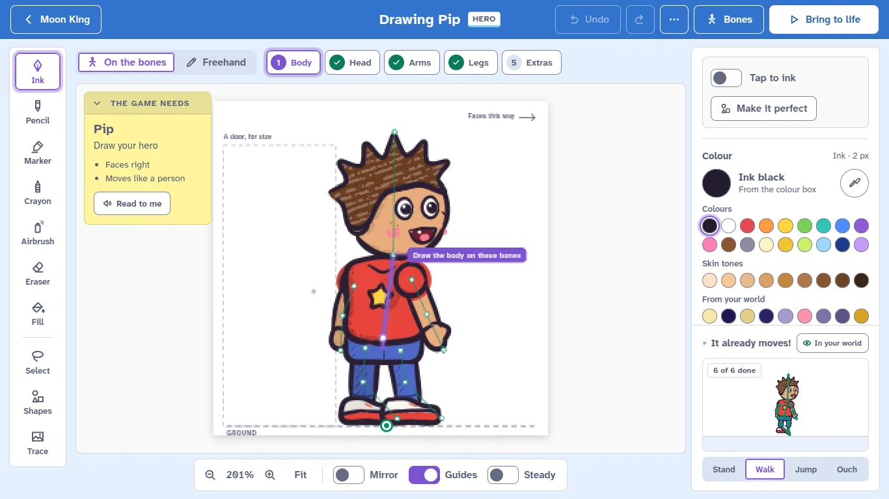
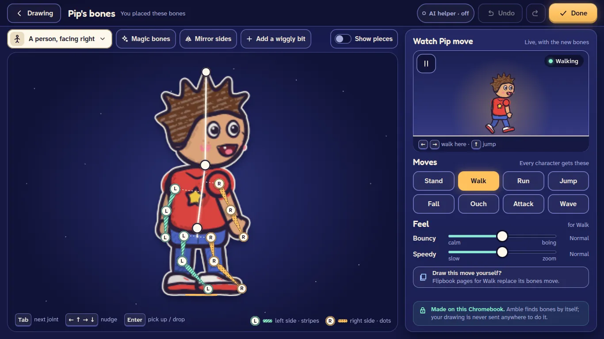
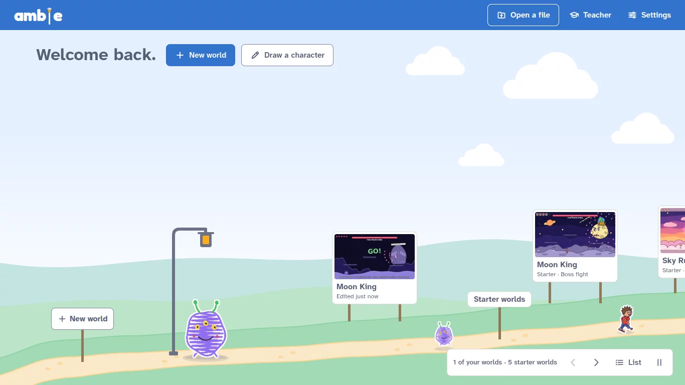

# Amble

**Draw a character. It comes alive.**

Amble is a game maker for students, made for school Chromebooks. A student draws a creature and presses **Bring it to life**: Amble finds bones under the drawing and it starts to hop. Then it stars in a real 2D game built on [Phaser](https://phaser.io/): a boss fight, a runner, a maze, a physics toy or a platformer. Everything else the game needs waits in the world as "just bones" until the student draws it. Students change their worlds with a wish in plain words ("make the jump floatier"), with dials and twists, or in the code itself.

The art is always the student's. Where a school sets one up, an AI service quietly turns a student's wishes into game code; it never draws. Students see the magic, not the machinery: the student screens never show AI labels, badges or sparkles, while Settings, the Teacher desk and the pages for families and IT say plainly what the AI does.

The look is Scratch's colour palette and shape language (light blue-grey pages, white panels, Scratch blue and purple, crisp 4 and 8 px corners), with Amble's own screens. Settings offers Original colours and High contrast.

Try it at <https://aboufama.github.io/amble/>. There is no account and no sign-in.



## What students do

- **Draw first.** A new student starts on a sheet of paper with six markers. **Bring it to life** gives the drawing bones, on the device, and it hops. Then the student picks a world for it.
- **The Trail** is home. Each world is a signboard along a daylight path over green hills, and the characters in them walk between the signs.
- **A world** is a running Phaser game with its **Cast** underneath: every character, item and background it uses. A new drawing drops into the running game without a restart. Undrawn members are dashed "just bones" outlines, and tapping one opens it on the Desk. In **Change** mode students tap anything in the world and turn its **Dials**. **Twists** such as Moon gravity and Giant mode bend the rules with no AI.
- **The Desk** is the drawing tool: pressure-sensitive ink, pencil, marker, crayon and airbrush, a fill that stays inside sketchy lines, shapes, layers, mirror and flipbook pages. A character the game asks for can be drawn **on the bones**, one body part at a time.
- **Bones** shows the skeleton Amble found, as stars over the drawing. Students move any joint with a pointer or the keyboard, pick the kind of body (a person, an animal on 4 legs, a flying or swimming animal, a blob, a thing) and preview the moves every character gets: stand, walk, run, jump, fall, ouch, attack and wave.
- **Wishes** change a world in plain words, in the **Change your world** box beside the game. A wish that only turns a dial or flips a twist ("make the jump higher") happens on the device, with no AI. Anything else goes to the school's AI service, if one is set up; the game keeps playing while it works, and the change lands with a "Done!" and an Undo. When no service is set up the box simply steps aside.
- **Footsteps** keeps every change, wishes included ("You wished: …"), and **Go back** never deletes a step. **Look inside** shows the world's real JavaScript, marks the lines that came from a wish, from the student or from a teacher, and runs the student's own edits.
- **Files and school.** Worlds save as `.amble` files (Save to Drive on a Chromebook). Teachers get a class link with a QR code, assignments, a gallery that plays a folder of turned-in worlds, and a letter for families. Students hand in through Google Classroom.

Everything works without AI except the AI's own jobs: granting wishes, planning a new world from an idea, explaining code, and suggesting joints. The five starter worlds (Moon King, Sky Run, Wobble Tower, Lantern Maze and Clank's Climb) play with no AI at all. A browser that still holds a game from the old block-based Amble is offered a one-way import of its drawings and sounds; the blocks don't come along.

|  |  |
|---|---|
| **A world.** The Moon King starter, playing. Grumble, marked "Your turn", is still just bones. | **The Desk.** Drawing Pip on the bones, with a live preview of Pip walking. |
|  |  |
| **Bones.** Pip's joints as stars, the left side striped and the right side dotted. | **The Trail.** The student's worlds as signs, and their characters walking the path. |

## Quick start

You need Node.js 22 (the version CI uses).

```bash
npm ci
npm run dev
```

Open <http://localhost:5173/>. A new browser profile starts on the First page. The AI helper stays off until you set one up (see [How the AI is configured](#how-the-ai-is-configured)).

## Commands

| Command | What it does |
|---|---|
| `npm run dev` | The Vite dev server. It rebuilds the game player when anything under `src/runtime/` changes. |
| `npm test` | Unit tests (vitest, in Node) in `tests/` and `server/`. |
| `npm run typecheck` | Type-checks the app and its unit tests (`tsconfig.json`), then the build config, e2e tests and dev server (`tsconfig.node.json`). |
| `npm run build` | Type-checks, then builds the static site into `dist/`. |
| `npm run preview` | Serves `dist/` locally. |
| `npm run test:e2e` | Playwright end-to-end tests in `e2e/`. |
| `npm run starters:build` | Rebuilds the starter worlds' committed assets in `public/starters/`. |

### End-to-end tests

The e2e tests start their own dev server on `E2E_PORT` (default 5199) and run in Playwright's Chromium, or in the Chromium that `PW_CHROMIUM_PATH` points at. They run at 1366x768 with software WebGL (SwiftShader). AI tests use a mocked endpoint (`e2e/helpers/mockAi.ts`); no test calls a real AI service.

```bash
# Everything in e2e/, with a Chromium you already have, on a port of your own
PW_CHROMIUM_PATH=/path/to/chromium E2E_PORT=5300 npm run test:e2e

# The subset CI runs before every deploy
PW_CHROMIUM_PATH=/path/to/chromium E2E_PORT=5300 npx playwright test journeys/first-five journeys/no-ai journeys/egress journeys/a11y journeys/layout

# The production build with its CSP, served under /amble/ on port E2E_PORT + 100 (only the tests tagged @prod)
PW_CHROMIUM_PATH=/path/to/chromium E2E_PORT=5300 npx playwright test --project prod
```

`E2E_REUSE=1` tests servers that are already running on those ports instead of starting new ones. The player core has its own spec and harness on port 5213: `npx playwright test -c dev/player/playwright.config.ts`.

### Starter worlds

`npm run starters:build` replays each starter drawing's stroke script through the real brush engine, exports it, fits its committed bones and checks them, validates every starter's code, and writes `public/starters/<id>/`. Then it robot-tests every starter in Chromium and redraws the Trail's signs. Pass starter ids to rebuild only those, and `--no-browser` to skip the Chromium step:

```bash
npm run starters:build -- moon-king --no-browser
```

Set `PW_CHROMIUM_PATH` for the Chromium step, and `STARTERS_OUT` for where its review images go (by default `test-results/starters`).

## How the AI is configured

No AI address or key ships with Amble, and nothing turns the AI helper on by default. Amble works with any OpenAI-compatible Chat Completions endpoint: it calls `POST {base URL}/chat/completions`, and `POST {base URL}/moderations` when moderation is set to `endpoint`. It reads its settings from these sources, highest first (`src/ai/config/`):

1. **ChromeOS managed configuration**, for Amble force-installed on managed Chromebooks.
2. **Build-time variables** (`VITE_AMBLE_*`) in a district's own build. They are public, so they hold the address and the policy, never a key: the build stops if a value looks like one.
3. **A class link** (`https://<amble>/#class=...`) that a teacher makes in the Teacher desk. It carries the AI address, a class code (sent only in a request header, `X-Amble-Class` by default), the class's AI mode (on, explain only or off), its content level and an expiry date.
4. **Manual settings** in Settings → AI helper → Set up AI (for grown-ups): a base URL (empty means OpenAI), an optional key, the model names and Test connection. They are for home use, and they are hidden in school builds, on managed devices and wherever a school provides the AI. A build with `VITE_AMBLE_AI_AUTH=user-key` shows only a key field, for the address the build set.

A school source can lock the AI settings, the content level and pictures, so lower sources can't change them. A teacher's class link can switch the AI helper off, or to explain only, for a class; it can't switch on what the district switched off. Every field is in [docs/DISTRICT-SETUP.md](docs/DISTRICT-SETUP.md).

Amble uses up to three models. The main model writes and changes code. The fast model plans new worlds and explains code. The vision model suggests joints for Magic bones, only where the district allows pictures and the student says OK for that drawing. The fast and vision models default to the main one.

**Local development.** Put `OPENAI_API_KEY` (and, if you like, `OPENAI_BASE_URL`) in a `.env` file (see `.env.example`). The dev server then proxies AI calls through `/api/openai`, so the key never reaches the browser, and `npm run dev` uses it when nothing above is set. Production builds never call `/api/*`.

## Privacy and safety

Amble has no accounts, no analytics, no ads, no cookies and no server of its own. Worlds, drawings and settings stay in the browser's storage on the device until a student saves an `.amble` file. The app talks to two kinds of places only: the host that serves its files and, when a student uses the AI helper, the AI address that a school or a grown-up set up. An AI request carries the student's words and what the AI needs about the world (its code and the list of things to draw). Amble never adds a student's name or initials, pen strokes, recordings or drawings; the one exception is a small black-and-white outline for AI joint hints, which the district must allow and the student must OK for each drawing. The last 50 requests are listed on the device exactly as they were sent (What Amble sends, `#/sent`). Games run in a sandboxed frame with no network access and no access to Amble's storage. Before anything is sent, an on-device filter checks the student's words, refuses what isn't OK for school and catches personal information; a district endpoint can add moderation, and the words a new version of a game would show are checked again before the student sees them. If a student's words suggest they may be in danger, nothing is sent: Amble shows a card that points them to a trusted adult, to 988 and to New Hampshire's Rapid Response line.

## Architecture at a glance

Vite, React 19, TypeScript and zustand; one IndexedDB database; hash routes (`#/trail`, `#/w/<id>`, `#/w/<id>/draw/<key>`...), because GitHub Pages can't serve app routes. Four cores do the heavy work, and nine modules build the screens on top of them. Modules reach the cores only through the typed barrels in `src/cores/`, and app code never imports Phaser or `src/runtime/` (a unit test enforces both).

| Core | Folders | What it does |
|---|---|---|
| Art engine | `src/art/engine/` | The brush engine: brushes, layers, the gap-closing fill, selection, shapes, flipbook frames, undo and export. Framework-free; fills, undo packing and PNG encoding run in a worker. |
| Rig | `src/rig/` | Auto-rig, binding a drawing to its bones, the procedural moves and the bone editing API. Auto-rig and binding run in a Web Worker on the device. |
| Player and runtime | `src/play/`, `src/runtime/`, `vite/ambleRuntime.ts` | The sandboxed game player: Phaser 3.90 plus the Amble kit in a `sandbox="allow-scripts"` frame with its own CSP (`connect-src 'none'`), one visible player plus one warm spare, and the message protocol (`src/play/protocol.ts`). |
| AI | `src/ai/` | The transport (one door for AI traffic), district configuration and class links, the game validator, the AMBLE PATCH parser and applier, and the safety filter. |

| Module | Folders | What it does |
|---|---|---|
| Home | `src/home/`, `src/screens/first/`, `src/screens/trail/`, `src/screens/newworld/` | The First page, the Trail, New world and the plan card. |
| World | `src/world/`, `src/screens/world/` | The running world: Play and Change, the Cast, Dials, Twists, the Ask card's frame. |
| Draw | `src/draw/`, `src/screens/draw/` | The Desk and Bring to life. |
| Bones | `src/bones/`, `src/screens/bones/` | The Bones view and Magic bones. |
| AI pipeline | `src/pipeline/`, `src/screens/ai/` | Plans, builds, changes and fixes; validation, the robot test in the hidden spare player, up to two repairs, the fallback to a starter, the on-device dial and twist matcher, and the safety cards. |
| Storage and files | `src/store/`, `src/files/`, `src/pwa/`, `src/screens/files/` | IndexedDB, autosave, `.amble` files, Save all my worlds, the service worker. |
| School and settings | `src/school/`, `src/screens/teacher/`, `src/screens/join/`, `src/screens/handin/`, `src/screens/settings/`, `src/screens/pages/` | Class links, the Teacher desk, Hand in, Settings and the in-app pages. |
| Starter worlds | `src/starters/`, `tools/starters/`, `public/starters/` | The five starters and the tool that builds their assets. |
| Footsteps and code | `src/history/`, `src/screens/footsteps/`, `src/screens/code/` | Footsteps, Go back, who wrote each line, and Look inside. |

Shared pieces: `src/app/` (routes, the app frame, the player host and layer), `src/ui/` (design system), `src/state/` (zustand slices), `src/model/` (types and limits), `src/i18n/en/` (every student-facing string), `src/legacy/` (the old Amble reader) and `src/audio/` (the sound synth). `vite/` holds the build plugins (the runtime bundle, the page CSP, the key guard, the dev-only guard, the image-generation guard, the service worker). `server/codexBridge.ts` is a dev-server bridge to a local Codex CLI and never ships. `dev/` holds harness pages for the cores.

## Deploy

`.github/workflows/pages.yml` publishes to GitHub Pages on every push to the branches it lists (today the working branch and `main`), and when it is run by hand. It has two jobs:

1. **e2e** installs Chromium and runs the fast journeys (the first five minutes, no AI, egress and the sandbox, accessibility, and layout) with one retry. If they fail, the test results are kept as a build artifact for 7 days, and nothing deploys.
2. **deploy** runs only after e2e passes: `npm ci`, `npm test`, `npm run build`, then it force-pushes `dist/` to the `gh-pages` branch. In the repository settings, Pages must serve the `gh-pages` branch from `/ (root)`.

The build uses relative paths (`base: './'`), so `dist/` works from any host and sub-path. It stops if a `VITE_` variable looks like it holds a key, if a dev-only test hook reached the bundle, or if any file names an image-generation endpoint or model. The full e2e suite and the `prod` project don't run in CI.

## For schools

Amble ships no AI address and no key. A district runs its own AI proxy and points Amble at it with ChromeOS managed configuration, its own build, or teachers' class links. [docs/DISTRICT-SETUP.md](docs/DISTRICT-SETUP.md) is the guide for a district technology coordinator: what Amble sends, provider choices, every configuration field, moderation and the crisis card, the web filter allowlist, accessibility, and what is still missing before a district rollout.

Inside the app: `#/it` (for IT), `#/privacy`, `#/terms`, `#/ai` (the AI helper's exact instructions), `#/parents` (a letter for families) and `#/accessibility`.

## Credits

Amble is made by Andre.

It is built with Phaser, React, zustand, CodeMirror, acorn, fflate and the fonts Fredoka, Atkinson Hyperlegible Next and JetBrains Mono; Settings → About lists each one's license. The repository doesn't have a LICENSE file yet (see the list at the end of [docs/DISTRICT-SETUP.md](docs/DISTRICT-SETUP.md)).
