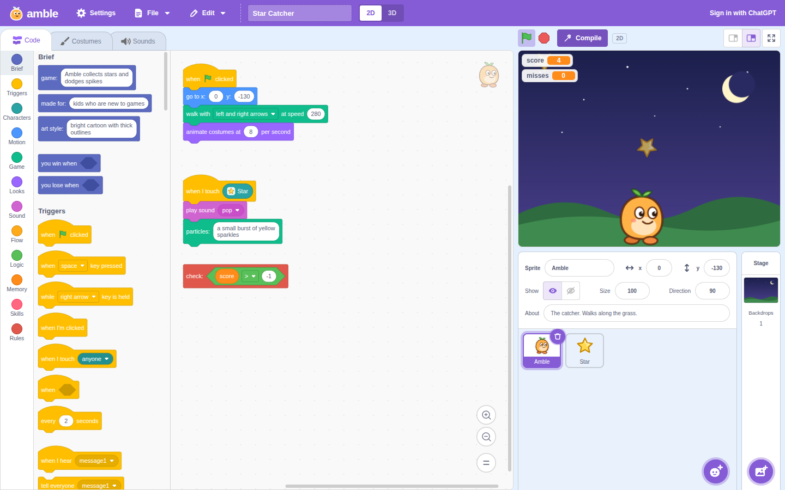
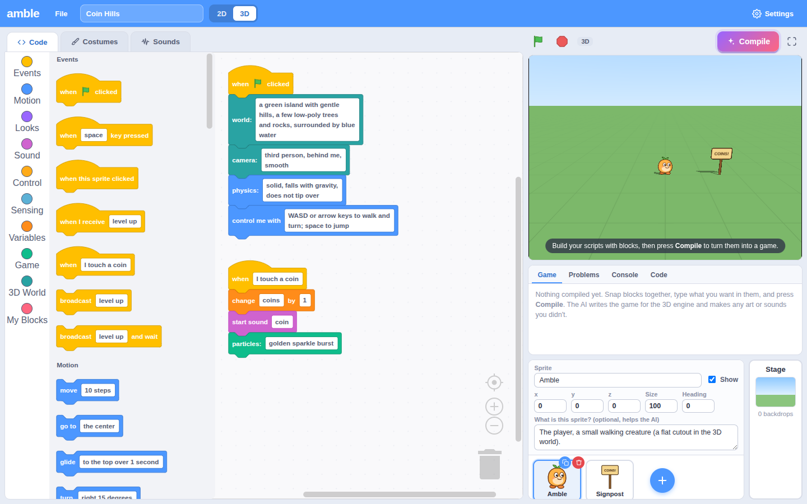

# Amble

Make games with Scratch-style blocks where **every input is plain English**. Press **Compile** and an AI (OpenAI for now) turns your blocks into a real 2D or 3D game running on [Babylon.js](https://www.babylonjs.com/).

**Try it:** https://aboufama.github.io/amble/ (open **Settings** and paste your OpenAI API key; it stays in your browser). Running Amble on your own computer? You can **sign in with ChatGPT** instead.



- **Blocks give the structure, text gives the meaning.** `when [space] key pressed` → `do [jump up and land on the platform]`. Scripts, loops, `if`/`else`, messages, clones and custom blocks work like Scratch, but you describe what happens in your own words.
- **You make the assets.** Paint costumes, upload images or `.glb` 3D models, record or synthesize sounds.
- **The compiler fills the gaps.** If the game needs something you didn't make (the stars in "catch the falling stars", a laser sound, a 3D crate), the AI generates it. It shows up as a **compiled asset** (dashed border, ✨ badge). Keep it to make it yours, or delete it and the next compile makes a new one. Compiled assets are reused between compiles so your game doesn't change looks every build.
- **2D and 3D in the same engine.** Pick a world with the 2D / 3D switch.



## Quick start

```bash
npm install
npm run dev            # http://localhost:5173
```

Then either:

- press **Sign in with ChatGPT** (top right). This needs the [Codex CLI](https://github.com/openai/codex) (`npm install -g @openai/codex`). Compiles then run on your ChatGPT plan with GPT-6 Astra Light, and no API key is needed ([details](#signing-in-with-chatgpt)), or
- open **Settings** and paste an OpenAI API key (stored only in your browser), or
- put `OPENAI_API_KEY=sk-...` in a `.env` file (see `.env.example`). The dev server then proxies OpenAI calls, and the key never reaches the browser.

Try **File → Examples → Star Catcher** or **Coin Hills (3D)** and press **Compile**.

Defaults: `gpt-5` with low reasoning writes the code; `gpt-5-mini` makes compiled art, models and sounds. Any model your key can use can be picked in Settings, and any OpenAI-compatible endpoint works via the base URL. Signed in with ChatGPT, everything uses GPT-6 Astra Light (`gpt-6-astra` with low reasoning).

### Signing in with ChatGPT

OpenAI only lets its own Codex app sign in with ChatGPT, not other websites. So when Amble runs on your computer, the dev server (`server/codexBridge.ts`) hands AI requests to your Codex CLI:

- **Sign in with ChatGPT** reuses the ChatGPT sign-in Codex already has, or runs `codex login`, which opens the ChatGPT sign-in page.
- Each request runs `codex exec` with GPT-6 Astra at low reasoning, the preset ChatGPT calls "Astra Light". It counts toward your ChatGPT plan's Codex usage.
- Codex runs in a read-only sandbox in an empty temporary folder, without your Codex config (`--ignore-user-config`) and without saving a session (`--ephemeral`).
- **Sign out** only stops Amble from using it; Codex stays signed in. Set `CODEX_PATH` if `codex` isn't on your PATH.

The GitHub Pages demo has no server, so there it's API keys only.

## How it works

```
 Blocks (text inputs)  ──►  Compiler (OpenAI, structured output)  ──►  Amble engine (Babylon.js + Havok)
 your costumes/sounds        code per sprite + new sprites +           runs in a sandboxed iframe
                             compiled assets (SVG / 3D / sound)
```

1. **Serialize.** Each sprite's scripts become indented pseudo-code (`src/compiler/serialize.ts`) along with its costumes, sounds, position and your descriptions.
2. **Compile.** The model gets a system prompt documenting the engine API (`src/compiler/prompt.ts`) and replies with strict JSON (`src/compiler/schema.ts`): one JavaScript class per sprite, any sprites it had to add, and the assets it needs.
3. **Check and harden.** Every class is parsed with acorn (`src/compiler/transform.ts`). Syntax errors trigger one automatic repair round. Loops get guards so a runaway `while (true)` pauses or stops instead of freezing the page. Missing `yield*` before `wait()` is added, and hooks that wait become coroutines.
4. **Make assets.** Compiled costumes are drawn as SVG by the chat model (or by an image model, if you choose that in Settings). 3D models are assembled from primitive shapes. Sounds come from a small synthesizer (`src/audio/synth.ts`). If generation fails, a placeholder keeps the game running.
5. **Run.** The game plays in an iframe with an opaque origin and a Content-Security-Policy that blocks all network access. Errors and console output flow back to the **Problems** and **Console** tabs. **Fix with AI** sends them back to the compiler.

### The engine

The Amble engine (`src/engine/`) is a thin, consistent game layer over Babylon.js:

- **Consistent timing.** Logic and physics run on Babylon's deterministic lockstep: exactly 60 ticks per second on every machine, independent of the monitor's refresh rate. `wait()`, timers and tweens use game time, not wall-clock time.
- **Unity-style sprites.** `class Player extends Sprite { start() {} update(dt) {} onKeyDown(key) {} onClick() {} onMessage(name, data) {} onCollide(other) {} onSpawn() {} }`, plus coroutines (`*start() { yield* this.wait(1) }`).
- **2D:** orthographic 480×360 stage in pixels (Scratch coordinates), costumes as textured sprites, scrolling camera, layers.
- **3D:** meters, sky, sun with shadows, ground, follow / first-person / orbit cameras. Image costumes are billboard cutouts; `.glb` and AI-made models are real meshes.
- **Physics:** Havok (dynamic/static/kinematic bodies, collisions, sensors). In 2D, bodies are constrained to the plane.
- **Also:** input (keys, mouse, touch, pointer lock), Web Audio sounds, HUD text/values/buttons, speech bubbles, questions, particles.
- **Full Babylon access:** compiled code can use the `BABYLON` namespace for anything the helpers don't cover.

Why Babylon.js? It's a full game engine (rendering, physics, particles, glTF, cameras, input) where 2D and 3D share one scene graph and API. It has a built-in fixed-timestep mode, and it's famously backward compatible, so AI-written code rarely breaks on version drift.

## Project layout

```
src/
  blocks/      block set (spec.ts) and Blockly setup (theme, wrapping text field, toolbox)
  compiler/    serializer, prompts, JSON schemas, OpenAI client, code instrumentation, compiled assets
  engine/      the game runtime that runs inside the player iframe (Babylon.js + Havok)
  player/      editor <-> player protocol, iframe host, run-package builder
  project/     data model, defaults and examples, persistence, importers, HTML export
  components/  React UI (blocks editor, paint editor, sounds, stage, output, sprite pane)
server/        dev-server bridge for "Sign in with ChatGPT" (runs the Codex CLI)
dev/engine-test.html   a page for poking the engine directly (npm run dev → /dev/engine-test.html)
```

## Saving and sharing

- Projects autosave in your browser (IndexedDB).
- **File → Save to your computer** writes a `.amble` file; **Open** reads it back.
- **File → Export playable web page** produces a single `.html` file with the engine, physics and your game inside. It runs anywhere, with no server.

## Deploying

`.github/workflows/pages.yml` builds the app on every push and publishes `dist/` to the `gh-pages` branch, which GitHub Pages serves (Settings → Pages → Deploy from a branch → `gh-pages`, `/ (root)`). The build uses relative paths, so it works from any sub-path. On a static host there's no server key and no ChatGPT sign-in: each visitor uses their own OpenAI key from Settings.

## Security notes

- The API key lives in `localStorage` (or on the dev server with `OPENAI_API_KEY`). Compiled games can't read it: the player iframe is sandboxed without `allow-same-origin`, and its CSP has no network access (`connect-src data: blob:`).
- AI-written SVG is sanitized (no scripts, event handlers, or external references) before use.
- The dev server's AI endpoints (`/api/openai`, `/api/codex`) only answer Amble's own page: they reject requests from other origins and require JSON, so other sites open in your browser can't use your key or your ChatGPT sign-in.

## Development

```bash
npm run typecheck
npm test                 # unit tests (vitest)
npm run test:e2e         # Playwright: compiles with a mocked OpenAI API and plays the result
npm run build            # production build in dist/ (includes amble-player.js and amble-havok.wasm)
```

To point Playwright at an already-installed Chromium, set `PW_CHROMIUM_PATH`, e.g. `PW_CHROMIUM_PATH=/path/to/chrome npm run test:e2e`.

## Ideas for next steps

- Drag sprites on the stage to position them; live previews of AI-made 3D models in the costume list.
- More providers (Anthropic, Gemini, local models). Everything goes through `src/compiler/openai.ts`.
- Show the AI a picture of your costumes so compiled art matches your style even more closely.
